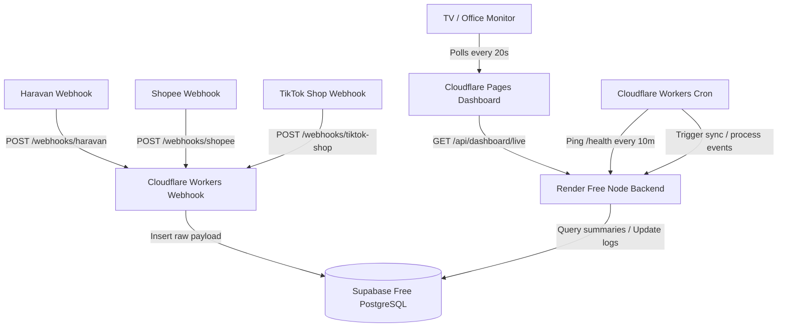

# MData Architecture

MData is designed to compile, normalize, and display marketing, ecommerce, and ads metrics under a $0/month budget using free-tier services. 

## Key Components

### 1. Frontend: React Dashboard
- **Host**: Cloudflare Pages Free.
- **Tech Stack**: React + Vite + TypeScript + Vanilla CSS + Recharts.
- **Polling Loop**: Requests live overview data every 20 seconds. If Render is asleep, it continues displaying cached metrics from the previous successful request (graceful fail-safe mode).

### 2. Webhook Gateway: Cloudflare Workers
- **Host**: Cloudflare Workers.
- **Role**: Receives Shopee, TikTok Shop, and Haravan payloads. CF Workers do not sleep and verify signatures instantly, writing raw payloads to Supabase `webhook_events` within milliseconds.

### 3. Backend: Express Core
- **Host**: Render Free Web Service.
- **Role**: Handles heavy platform APIs request paging, OAuth credential rotation, metric summaries recalculation, and database cleanups.
- **Sleep Management**: CF Worker crons wake up Render by requesting `/health` every 10 minutes.

### 4. Database: Supabase PostgreSQL
- **Host**: Supabase Free.
- **Role**: Holds the source-of-truth orders, credentials, logs, and pre-computed metrics. 
- **Efficiency**: Avoids raw table scans during dashboard rendering. The dashboard requests data directly from `hourly_metrics` and `daily_metrics` compiled by a backend cron service.
